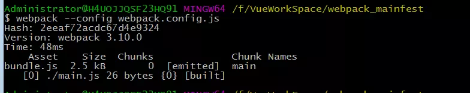
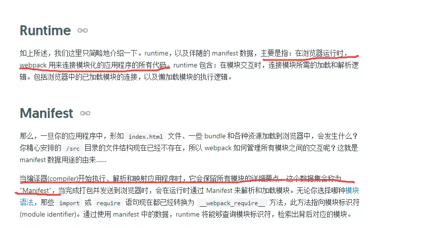
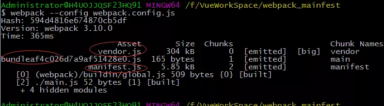

>通常我们的项目包含三种类型的代码：业务代码、第三方依赖库、webpack打包构建后的manifest。官网经常会看到mainfest这个词，但是它究竟指什么，我们来做个实验找答案吧：（ps：文章把manifest打成mainfest了）

    1 mkdir  webpack_mainfest   //在当前目录下，创建项目目录 webpack_mainfest
    2 npm init
    3 npm install webpack
    2 cd  webpack_mainfest  // 进入项目目录
    3 touch main.js   // 创建入口文件
    5 touch wepack.config.js  //创建webpack 配置文件

webpack.config.js
```js
const path = require('path');

  module.exports = {
    entry: './main.js',
    output: {
     filename: 'bundle.js',
      path: path.resolve(__dirname, 'dist')
    }
  }
```
main.js
```js
console.info('入口文件也是一个模块')
```

然后，我们就直接打包： webpack --config webpack.config.js
    


可以看出，打包是只是引入一个模块
我们看一下打包之后生成bundle.js的内容：
```js
/******/ (function(modules) { // webpackBootstrap
/******/    // The module cache
/******/    var installedModules = {};
/******/
/******/    // The require function
/******/    function __webpack_require__(moduleId) {
/******/
/******/        // Check if module is in cache
/******/        if(installedModules[moduleId]) {
/******/            return installedModules[moduleId].exports;
/******/        }
/******/        // Create a new module (and put it into the cache)
/******/        var module = installedModules[moduleId] = {
/******/            i: moduleId,
/******/            l: false,
/******/            exports: {}
/******/        };
/******/
/******/        // Execute the module function
/******/        modules[moduleId].call(module.exports, module, module.exports, __webpack_require__);
/******/
/******/        // Flag the module as loaded
/******/        module.l = true;
/******/
/******/        // Return the exports of the module
/******/        return module.exports;
/******/    }
/******/
/******/
/******/    // expose the modules object (__webpack_modules__)
/******/    __webpack_require__.m = modules;
/******/
/******/    // expose the module cache
/******/    __webpack_require__.c = installedModules;
/******/
/******/    // define getter function for harmony exports
/******/    __webpack_require__.d = function(exports, name, getter) {
/******/        if(!__webpack_require__.o(exports, name)) {
/******/            Object.defineProperty(exports, name, {
/******/                configurable: false,
/******/                enumerable: true,
/******/                get: getter
/******/            });
/******/        }
/******/    };
/******/
/******/    // getDefaultExport function for compatibility with non-harmony modules
/******/    __webpack_require__.n = function(module) {
/******/        var getter = module && module.__esModule ?
/******/            function getDefault() { return module['default']; } :
/******/            function getModuleExports() { return module; };
/******/        __webpack_require__.d(getter, 'a', getter);
/******/        return getter;
/******/    };
/******/
/******/    // Object.prototype.hasOwnProperty.call
/******/    __webpack_require__.o = function(object, property) { return Object.prototype.hasOwnProperty.call(object, property); };
/******/
/******/    // __webpack_public_path__
/******/    __webpack_require__.p = "";
/******/
/******/    // Load entry module and return exports
/******/    return __webpack_require__(__webpack_require__.s = 0);
/******/ })
/************************************************************************/
/******/ ([
/* 0 */
/***/ (function(module, exports) {

console.info('入口文件也是一个模块')

/***/ })
/******/ ]);

```

我们只是引入一个main.js模块，但是实际生成的bundle.js确实非常多。
前面的一大堆就是mainfest，准确来说是，runtime代码。官网的描述是这样的：



>其实这里，webpack帮我们定义了一个webpack_require的加载模块的方法，而mainfest模块数据集合就是对应着bundle.js第三行的 installedModules 。每当我们在main.js入口文件引入一模块，installModules就会发生变化，当我们页面点击跳转，加载对应模块就是通过__webpack_require__方法在installModules中找对应模块信息，进行加载。


那这个跟缓存有什么关系呢？

    1、我们知道浏览器加载js文件，如果文件名是一致的会优先从本地缓存拿，如果没有才向服务器这边请求。这个是时候，我们可以知道，如果是业务代码，比如我优化了一个功能，更改了个bug，如果文件名没有变化，请求时，浏览器用了缓存数据，则我们的新代码没被用上，因为浏览器用了旧代码文件。所以，output的选项中的filename，就不在是bundle.js ,而对应着bungdle[chunkhash].js，因为每次打包时，chunkhash都不同，所以打出来的文件名居不同，浏览器就不会直接用缓存数据了，而是请求新文件

    2、实际上，我们发现只有我们业务代码经常变化，而第三方依赖库是很少变化的，比如你使用了vue、vue-router、或者react等第三方库，这些是不会变化，那我们希望浏览器如果有的话，就不用再请求。但是，我们打包都整合到一个bundle[chunkhash].js上了，所以，我们需要借助webpack.optimize.CommonsChunkPlugin来帮我们分离代码，将mainfest、第三方库包，业务代码独立成三个文件
```js
// 抽出第三方库，命名vendor，不需要加chunkhash，因为他很少变化
// minChunk 判断哪些模块可以抽出来合并成ventor，这里只要是从node_module出来就抽
// 注意一定要放在mainfest的前面
new webpack.optimize.CommonsChunkPlugin({
      name: 'vendor',
      minChunks: function (module, count) {
        // any required modules inside node_modules are extracted to vendor
        return (
          module.resource &&
          /\.js$/.test(module.resource) &&
          module.resource.indexOf(
            path.join(__dirname, '../node_modules')
          ) === 0
        )
      }
    }),
// 抽出mainfest
new webpack.optimize.CommonsChunkPlugin({
      name: 'manifest',
      chunks: ['vendor']
 })

 ```

 而我们的业务代码是配置在output选项的，这样就会生成bundle[chunkhash].js 、vendor.js、mainfest.js,三个文件。
我们来试一下：
```js
npm install vue   //第三方库
// 同时main.js，改成
console.info('入口文件也是一个模块')
var vue = require('vue')
```

然后webpack.config.js 按上面加入两个插件
```js
const path = require('path');
  const webpack = require('webpack');

  module.exports = {
    entry: './main.js',
    output: {
     filename: 'bundle[chunkhash].js',
      path: path.resolve(__dirname, 'dist')
    },
    resolve: {
        alias: {
          'vue$': 'vue/dist/vue.esm.js',
        }
      },
    plugins: [
        // 抽出第三方库，命名vendor，不需要加chunkhash，因为他很少变化
        // minChunk 判断哪些模块可以抽出来合并成ventor，这里只要是从node_module出来就抽
        // 注意一定要放在mainfest的前面
        new webpack.optimize.CommonsChunkPlugin({
              name: 'vendor',
              filename: "vendor.js",
              minChunks: function (module, count) {
                // any required modules inside node_modules are extracted to vendor
                return (
                  module.resource &&
                  /\.js$/.test(module.resource) &&
                  module.resource.indexOf(
                    path.join(__dirname, '/node_modules')
                  ) === 0
                )
              }
            }),
        // 抽出mainfest
        new webpack.optimize.CommonsChunkPlugin({
              name: 'manifest',
              filename: 'manifest.js'
         })
    ]
  }
```

执行 webpack --config webpack.congfig.js, 生成三个对应文件。这样来说，ventor一样的，然后浏览如果是第二次请求，会走缓存路线，不必再次加载。而bundle[chunkhash].js也就是我们的业务代码，可以避免缓存的影响



实际上，mainfest也会发生变化，它的变化在于你是否增加了模块，比如新引入一个js文件之类，mainfest也会变化。明白了mainfest，我们就可以更好的处理我们的缓存机制了.
